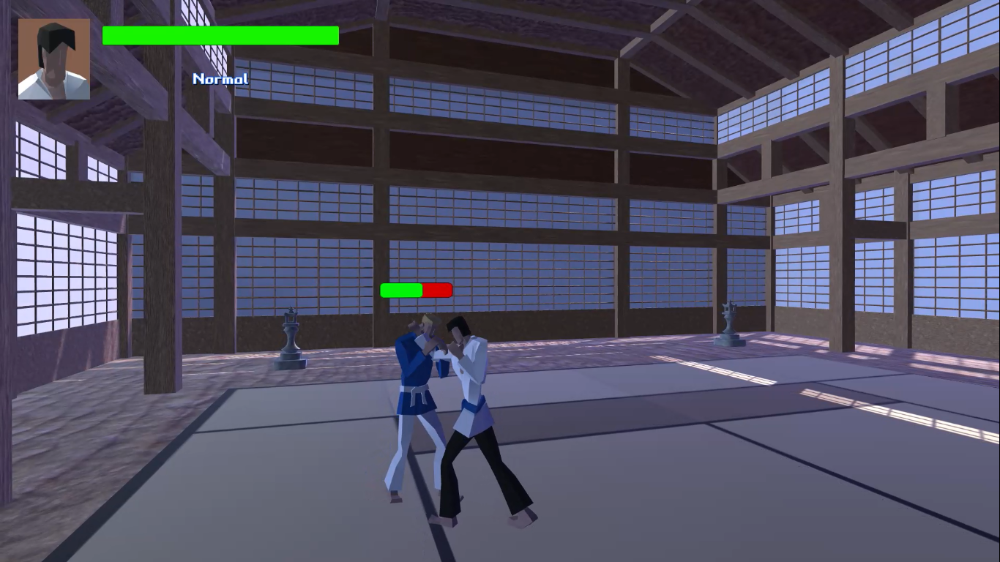
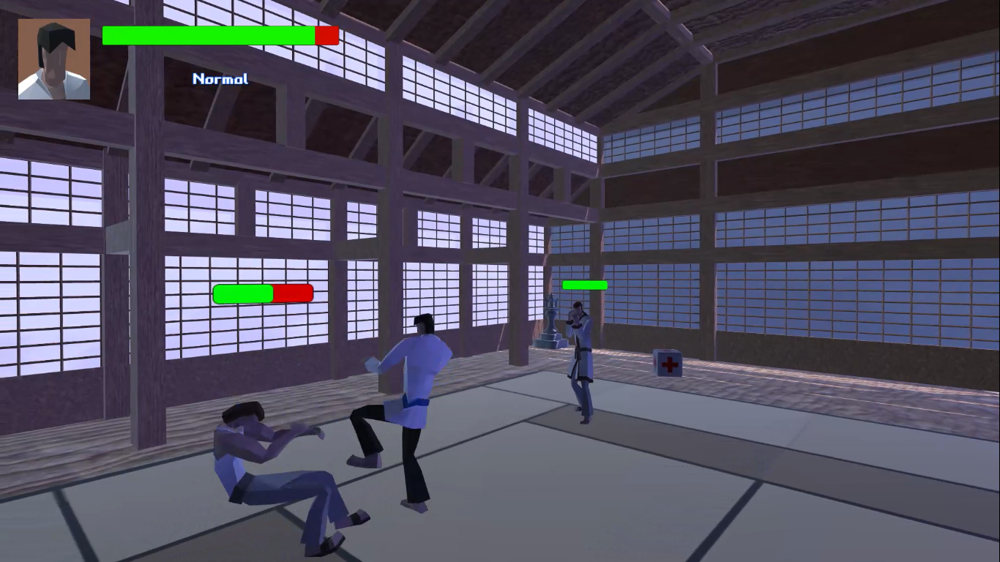
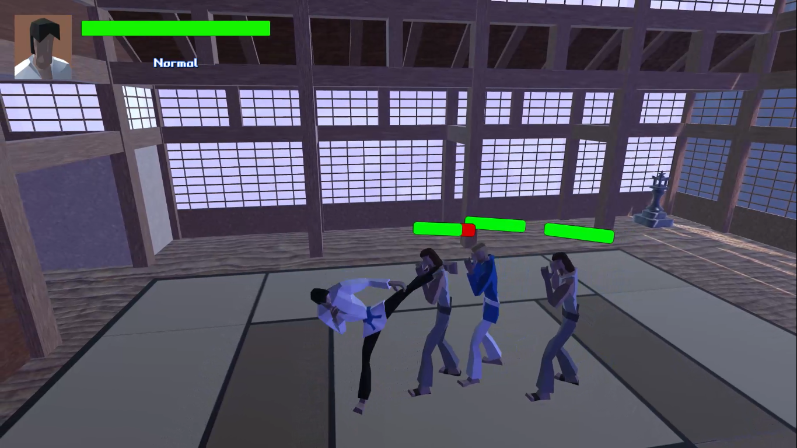

# Fighting-Survival
3D Fighting game simple prototype  game  in Unity  
developed in Unity 2018.3.0f2  

Next steps: 
1- refining and refactoring some main classes for better structure of the game project 
2- remove the Standard assets Camera and Third Character controller and implement a unique one for the this game and future use 
3- adding more animations/movement for the enemies AI 
